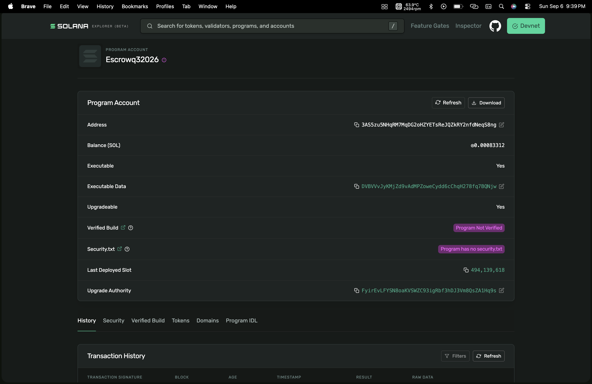
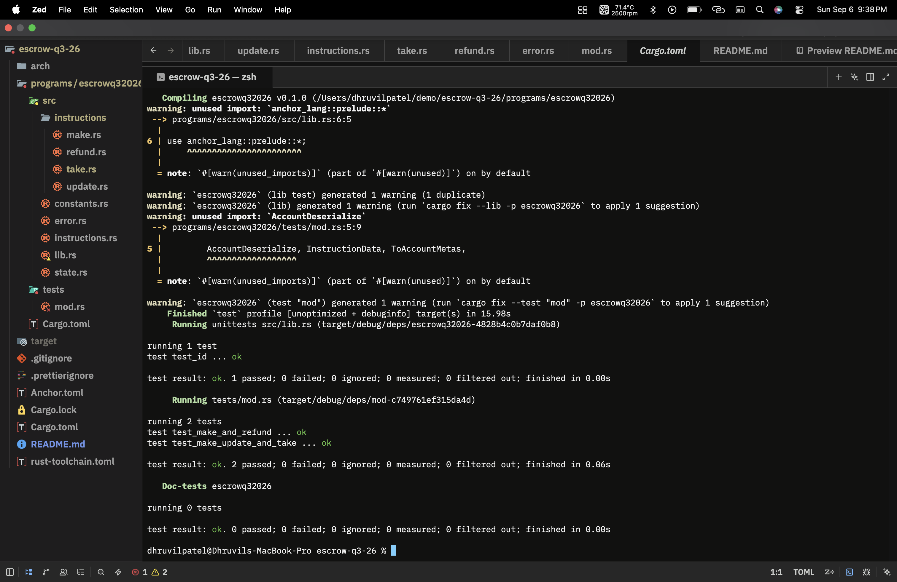

# Timed Escrow Program on Solana

This repository contains a Solana smart contract (program) written in Rust using the Anchor framework. It implements a secure, two-party token swap (escrow) with a time-lock mechanism.

## Overview
The escrow program allows two untrusted parties to exchange tokens seamlessly. A Maker deposits Token A into a program-controlled vault and specifies how much of Token B they want in return, along with a deadline. A Taker can come along and complete the swap, but only if they act before the deadline expires.

## Instructions

- **`Make`**: Initializes the escrow. The Maker deposits Token A into a Program Derived Address (PDA) vault, specifies the desired amount of Token B, and sets a strict expiration timestamp.
- **`Update`**: Allows the Maker to modify the expected receive amount (Token B) and the expiration deadline of an active escrow.
- **`Take`**: Completes the atomic swap. The Taker sends Token B to the Maker and receives Token A from the vault. **Condition**: This instruction will fail if the current Solana `Clock` timestamp has passed the escrow's expiration.
- **`Refund`**: Cancels the escrow. The Maker reclaims their Token A and closes the vault. **Condition**: This instruction will fail if the escrow has *not* yet expired. 

## Extensions Implemented
- **Timed Escrow**: Successfully integrates the `Clock` sysvar to enforce time-based limit orders. Escrows are completely locked from refunds while active, and locked from takers once expired.

## Prerequisites
- [Rust](https://www.rust-lang.org/tools/install)
- [Solana CLI](https://docs.solana.com/cli/install-solana-cli-tools)
- [Anchor CLI](https://www.anchor-lang.com/docs/installation)

## Build and Test

1. Build the Solana program:
   ```bash
   anchor build
   ```
2. Run the LiteSVM test suite:
   ```bash
   anchor test
   ```


## Devnet Deployed Contract
- [Contract Link](https://explorer.solana.com/address/3AS5zu5NHqRM7MqDG2oHZYETsReJQZkRY2nfdNeqS8ng?cluster=devnet)

-


## Test Results

